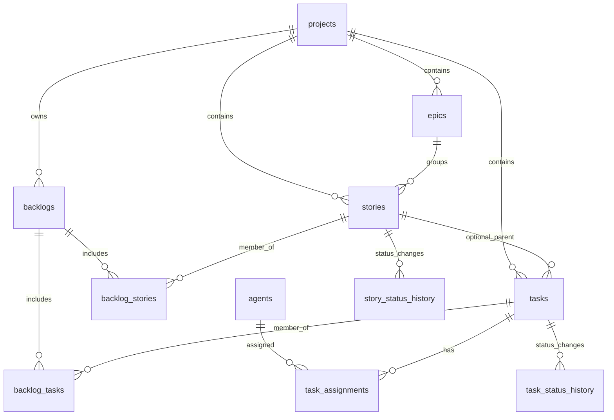

# Entity Model — Mission Control Work Planning (Jira-like, v1 draft)

**Status:** Draft (for scope alignment)  
**Date:** 2026-02-26  
**Applies to:** Mission Control DB refactor

## Purpose

This document defines a practical v1 entity model for planning and executing agent work in OpenClaw.

The model must support:
- many projects,
- work beyond coding (research, marketing, operations, etc.),
- task assignment to multiple agents over time,
- backlogs that group both **stories** and **tasks**,
- both project-scoped and global backlog use cases.

---

## Design Principles (v1)

1. **Generic work model** — not coding-only.
2. **Incremental complexity** — Jira-like structure, but "Epic Lite" first.
3. **Auditability first** — status/assignment history persisted.
4. **OpenClaw integration** — agents represented in DB, synced from `openclaw.json`.
5. **Backlog as a container** — backlog is not a task status.

---

## Core Hierarchy

Primary planning hierarchy:

`Project -> Epic (optional) -> Story -> Task`

Operational containers:

`Backlog -> {Stories, Tasks}`

Backlog can be:
- project-scoped (`project_id != NULL`), or
- global (`project_id = NULL`) for ideas/future projects.

---

## Status Model

### Shared workflow status (Stories + Tasks)

- `TODO`
- `IN_PROGRESS`
- `CODE_REVIEW`
- `VERIFY`
- `DONE`

### Epic status (simplified)

- `TODO`
- `IN_PROGRESS`
- `DONE`

### Backlog status (container lifecycle)

- `ACTIVE`
- `CLOSED`

> Note: legacy filesystem state `BLOCKED` is not part of the new status list. In v1 we model blocking via `is_blocked` + `blocked_reason` on Stories/Tasks.

---

## Entity Overview

| Entity | Purpose |
|---|---|
| `projects` | Top-level domain/workspace container |
| `epics` | Optional grouping of related stories in a project |
| `stories` | User-story level intent and scope |
| `tasks` | Executable work items (atomic-ish units) |
| `backlogs` | Named containers (backlog/sprint/ideas) |
| `backlog_stories` | Story membership in backlog |
| `backlog_tasks` | Task membership in backlog |
| `agents` | Runtime/planning representation of OpenClaw agents |
| `task_assignments` | Assignment history task -> agent |
| `story_status_history` | Story status audit trail |
| `task_status_history` | Task status audit trail |

---

## Table-Level Model (v1)

## 1) `projects`

| Field | Type (SQLite) | Req | Notes |
|---|---|---|---|
| `id` | `TEXT` (UUID) | yes | PK |
| `key` | `TEXT` | yes | unique short key, e.g. `MC` |
| `name` | `TEXT` | yes | display name |
| `description` | `TEXT` | no | optional |
| `status` | `TEXT` | yes | `ACTIVE` / `ARCHIVED` |
| `created_at` | `TEXT` | yes | ISO datetime |
| `updated_at` | `TEXT` | yes | ISO datetime |

---

## 2) `epics` (Epic Lite)

| Field | Type | Req | Notes |
|---|---|---|---|
| `id` | `TEXT` (UUID) | yes | PK |
| `project_id` | `TEXT` | yes | FK -> `projects.id` |
| `key` | `TEXT` | yes | unique per project |
| `title` | `TEXT` | yes | epic name |
| `description` | `TEXT` | no | optional |
| `status` | `TEXT` | yes | `TODO` / `IN_PROGRESS` / `DONE` |
| `priority` | `INTEGER` | no | optional ordering |
| `created_at` | `TEXT` | yes | ISO datetime |
| `updated_at` | `TEXT` | yes | ISO datetime |

Constraints:
- `UNIQUE(project_id, key)`

---

## 3) `stories`

| Field | Type | Req | Notes |
|---|---|---|---|
| `id` | `TEXT` (UUID) | yes | PK |
| `project_id` | `TEXT` | no | nullable for pre-project ideas |
| `epic_id` | `TEXT` | no | FK -> `epics.id` |
| `key` | `TEXT` | no | optional key, unique inside project when present |
| `title` | `TEXT` | yes | short summary |
| `intent` | `TEXT` | no | why this matters |
| `description` | `TEXT` | no | detailed scope |
| `story_type` | `TEXT` | yes | e.g. `feature`,`research`,`marketing`,`ops` |
| `status` | `TEXT` | yes | shared workflow status |
| `is_blocked` | `INTEGER` | yes | boolean (0/1), default 0 |
| `blocked_reason` | `TEXT` | no | optional |
| `priority` | `INTEGER` | no | optional ordering |
| `created_at` | `TEXT` | yes | ISO datetime |
| `updated_at` | `TEXT` | yes | ISO datetime |
| `completed_at` | `TEXT` | no | set on done |

Constraints/Rules:
- If `epic_id` is set, story should belong to same project as epic.
- Story may exist without project while still in global ideas backlog.

---

## 4) `tasks`

| Field | Type | Req | Notes |
|---|---|---|---|
| `id` | `TEXT` (UUID) | yes | PK |
| `project_id` | `TEXT` | no | nullable for global ideas |
| `story_id` | `TEXT` | no | optional FK -> `stories.id` |
| `key` | `TEXT` | no | optional key, unique inside project when present |
| `title` | `TEXT` | yes | short summary |
| `objective` | `TEXT` | no | detailed goal |
| `task_type` | `TEXT` | yes | `coding`,`research`,`marketing`,`ops`,... |
| `status` | `TEXT` | yes | shared workflow status |
| `is_blocked` | `INTEGER` | yes | boolean (0/1), default 0 |
| `blocked_reason` | `TEXT` | no | optional |
| `priority` | `INTEGER` | no | optional ordering |
| `estimate_points` | `REAL` | no | optional estimate |
| `due_at` | `TEXT` | no | optional deadline |
| `current_assignee_agent_id` | `TEXT` | no | denormalized quick lookup |
| `created_at` | `TEXT` | yes | ISO datetime |
| `updated_at` | `TEXT` | yes | ISO datetime |
| `started_at` | `TEXT` | no | optional |
| `completed_at` | `TEXT` | no | set on done |

Decision:
- **Task -> Story is optional in v1** (`story_id` nullable).
- This allows project-level operational tasks and ad-hoc execution tasks.

---

## 5) `backlogs`

| Field | Type | Req | Notes |
|---|---|---|---|
| `id` | `TEXT` (UUID) | yes | PK |
| `project_id` | `TEXT` | no | nullable => global backlog |
| `name` | `TEXT` | yes | e.g. `Backlog`, `Sprint 12`, `Future Ideas` |
| `kind` | `TEXT` | yes | `BACKLOG`,`SPRINT`,`IDEAS` |
| `status` | `TEXT` | yes | `ACTIVE` / `CLOSED` |
| `goal` | `TEXT` | no | sprint/backlog goal |
| `start_date` | `TEXT` | no | date for sprint |
| `end_date` | `TEXT` | no | date for sprint |
| `created_at` | `TEXT` | yes | ISO datetime |
| `updated_at` | `TEXT` | yes | ISO datetime |

Rules:
- A project can have many backlogs.
- Global backlog (`project_id = NULL`) supports ideas for future projects.

---

## 6) `backlog_stories`

| Field | Type | Req | Notes |
|---|---|---|---|
| `backlog_id` | `TEXT` | yes | FK -> `backlogs.id` |
| `story_id` | `TEXT` | yes | FK -> `stories.id` |
| `position` | `INTEGER` | yes | ordering inside backlog |
| `added_at` | `TEXT` | yes | ISO datetime |

Constraints:
- `PRIMARY KEY(backlog_id, story_id)`
- `UNIQUE(story_id)` (story in max one backlog at a time)

---

## 7) `backlog_tasks`

| Field | Type | Req | Notes |
|---|---|---|---|
| `backlog_id` | `TEXT` | yes | FK -> `backlogs.id` |
| `task_id` | `TEXT` | yes | FK -> `tasks.id` |
| `position` | `INTEGER` | yes | ordering inside backlog |
| `added_at` | `TEXT` | yes | ISO datetime |

Constraints:
- `PRIMARY KEY(backlog_id, task_id)`
- `UNIQUE(task_id)` (task in max one backlog at a time)

---

## 8) `agents`

| Field | Type | Req | Notes |
|---|---|---|---|
| `id` | `TEXT` (UUID) | yes | PK |
| `openclaw_key` | `TEXT` | yes | unique id/key from `openclaw.json` |
| `name` | `TEXT` | yes | display name |
| `role` | `TEXT` | no | e.g. `Principal Developer` |
| `worker_type` | `TEXT` | no | e.g. `coder`,`research`,`qa` |
| `is_active` | `INTEGER` | yes | boolean |
| `source` | `TEXT` | yes | `openclaw_json` or `manual` |
| `metadata_json` | `TEXT` | no | raw extra config |
| `last_synced_at` | `TEXT` | no | sync timestamp |
| `created_at` | `TEXT` | yes | ISO datetime |
| `updated_at` | `TEXT` | yes | ISO datetime |

Integration note:
- `openclaw.json` remains runtime config source.
- DB `agents` table is operational planning source (assignments, analytics, history).
- Sync job upserts agents by `openclaw_key`.

---

## 9) `task_assignments`

| Field | Type | Req | Notes |
|---|---|---|---|
| `id` | `TEXT` (UUID) | yes | PK |
| `task_id` | `TEXT` | yes | FK -> `tasks.id` |
| `agent_id` | `TEXT` | yes | FK -> `agents.id` |
| `assigned_at` | `TEXT` | yes | ISO datetime |
| `unassigned_at` | `TEXT` | no | null while active |
| `assigned_by` | `TEXT` | no | actor/system |
| `reason` | `TEXT` | no | optional note |

Constraints:
- one active assignment per task (`UNIQUE(task_id)` where `unassigned_at IS NULL` via partial index)

---

## 10) `story_status_history`

| Field | Type | Req | Notes |
|---|---|---|---|
| `id` | `TEXT` (UUID) | yes | PK |
| `story_id` | `TEXT` | yes | FK -> `stories.id` |
| `from_status` | `TEXT` | no | nullable for first state |
| `to_status` | `TEXT` | yes | target state |
| `changed_at` | `TEXT` | yes | ISO datetime |
| `changed_by` | `TEXT` | no | actor/system |
| `note` | `TEXT` | no | reason/comment |

---

## 11) `task_status_history`

| Field | Type | Req | Notes |
|---|---|---|---|
| `id` | `TEXT` (UUID) | yes | PK |
| `task_id` | `TEXT` | yes | FK -> `tasks.id` |
| `from_status` | `TEXT` | no | nullable for first state |
| `to_status` | `TEXT` | yes | target state |
| `changed_at` | `TEXT` | yes | ISO datetime |
| `changed_by` | `TEXT` | no | actor/system |
| `note` | `TEXT` | no | reason/comment |

---

## Relationship Map

---

## Domain Rules / Invariants

1. Story and Task may exist without `project_id` only for early-stage/global-ideas flow.
2. If an item is in a project backlog, its `project_id` must match the backlog project.
3. If task has `story_id`, task and story should share same `project_id` (or task inherits story project).
4. Task has at most one active assignee at a time.
5. Story/task are each in at most one backlog at a time (v1 simplification).
6. Every status change and assignment change must be persisted in history tables.

---

## Open Questions (for next iteration)

1. Should "project-less" stories/tasks be allowed permanently, or auto-forced into a project at execution time?
2. Should Epic status be derived from child stories or editable manually?
3. Do we need WIP limits per backlog/sprint in v1 or v2?
4. Should we support multi-assignee tasks later (currently single active assignee)?

---

## Suggested Migration Path (high-level)

1. Create new tables in `mission-control.db` for planning domain.
2. Build importer from filesystem (`STORY.md`, task YAML, task folders) into DB entities.
3. Run dual-read validation (filesystem vs DB views).
4. Switch UI/API reads to DB.
5. Keep optional filesystem export for Supervisor compatibility until full cutover.

---

## Navigation

- ↑ [Documentation Index](./INDEX.md)
- ↑ [README.md](../README.md)
- ↑ [AGENTS.md](../AGENTS.md)
